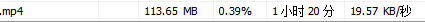
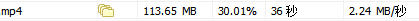

# 拥塞控制算法比较
## A. 算法介绍

### 1. 原版BBR

* 优点：官方新核心整合不占用系统资源，安装成功率高，TCP加速效果比较明显，可以对网站、Shadowsocks/SSR/V2ray流量进行加速。

* 缺点：不支援OpenVZ架构的系统，加速效果略逊于其它几款。

> **下载安装：**
> * BBR一键安装：[VPS伺服器Google BBR一键安装指令码](https://ssr.tools/199)

 

### 2. 魔改BBR

* 优点：由于是官方BBR基础上的激进版本，所以优点与原版BBR基本一致，加速效果更为明显。

* 缺点：不支援OpenVZ架构的系统，不支援部分系统版本安装。

> **下载安装：**
> * 魔改BBR一键安装：[南琴浪版暴力魔改BBR一键安装指令码 附加速50倍效果图](https://ssr.tools/550)

### 3. 锐速

* 优点：仅需在伺服器端安装，无需客户端，TCP加速效果明显，可以对网站、Shadowsocks/SSR/V2ray流量进行加速。

* 缺点：不支援OpenVZ架构的系统安装；不支援部分系统核心安装。

> **下载安装：**
> * 锐速一键安装：[锐速一键安装指令码，附加速40倍效果图](https://ssr.tools/533)
> 
> * 锐速Windows版下载：[锐速Windows破解版下载安装及使用教程 附加速23倍效果图](https://ssr.tools/573)

### 4. KCPTUN

* 优点：不挑架构，OpenVZ也能装；不挑系统版本；加速效果非常明显；可以避开TCP流量限速；可以与锐速/BBR同时安装（加速效果不叠加，因为KCPTUN是UDP流量）。

* 缺点：***需要在本地装置安装客户端；仅加速特定埠，不能对伺服器上的网站进行加速。***

> **下载安装：**
> * [超级加速工具KCPTUN一键安装指令码 附100倍加速效果图](https://ssr.tools/588)
> 
> * KCPTUN客户端下载：[KCPTUN各平台客户端下载汇总 附KCPTUN搭建流程](https://ssr.tools/637)

 

## B. 加速测试

### 1. 无加速、原版BBR、魔改BBR、锐速 测试
#### 单执行绪下载
**加速排名：魔改BBR > 锐速 > 原版BBR**

* 无加速：

* 原版BBR：

* 锐速：

* 魔改BBR：

 

#### 多执行绪下载
**加速排名：魔改BBR > 锐速 > 原版BBR**

* 无加速：

* 原版BBR：

* 锐速：

* 魔改BBR：

 

### 2. KCPTUN测试

#### 多执行绪下载

以下测试通过KCPTUN对同一伺服器的SSR流量进行加速，下载同一伺服器上的档案进行。因为KCPTUN不能直接对TCP流量加速。

* 无加速：

/Users/doge/github/breaking-gfw-book/docs/image/2018-11-22_111102.jpg

* KCPTUN：

 

#### Youtube视讯观看

* 无加速：由于较差的网路环境，不加速无法观看。
* KCPTUN：基本可以播放4K视讯，流畅播放1440P视讯。

 
#### KCPTUN测试小结

KCPTUN的测试，是在一台网路极差的VPS上进行的，所以测试基数较差，但加速效果显著。

不加速情况下，多执行绪下载速度不到20KB/S，经过加速后，可以达到2.24MB/S，提高了100倍以上。

不加速情况下，Youtube网页开启缓慢，最低解析度视讯无法流畅播放，加速后，可以流畅观看1440P视讯。

 

## C. 加速测试总结

如果以加速倍数为效果基准，那么KCPTUN胜出。

**具体排名：KCPTUN > 魔改BBR > 锐速 > 原版BBR**

 

如果以安装使用的难易程度来说，原版BBR或魔改BBR更为方便。

**具体排名：原版BBR > 魔改BBR > 锐速 > KCPTUN**

 

综合推荐：

* 如果你对加速效果有较高追求，那么建议首选KCPTUN，效果高出其它几款一大截，并且OVZ平台也能用。
* 如果你想要一个各方面比较平衡的、无需客户端的方案，那么魔改BBR是不错的选择。
* 如果你只想对伺服器上架设的网站加速，那么也可以选择魔改BBR。
* 如果你的VPS伺服器是OVZ架构，那么建议首选KCPTUN，其次OVZ魔改BBR。

## 参考文献
* [TCP BBR拥塞控制算法解析](https://blog.csdn.net/ebay/article/details/76252481)
* [锐速/BBR/魔改BBR/KCPTUN加速效果对比测试](https://ssr.tools/674)