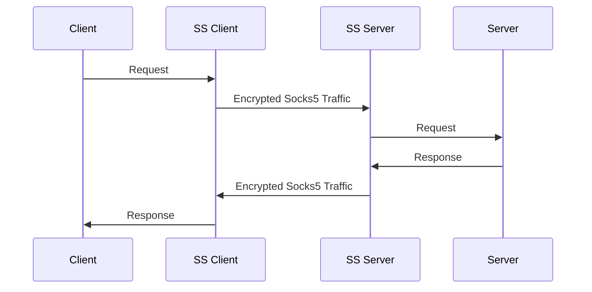
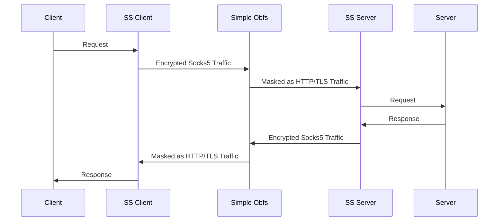
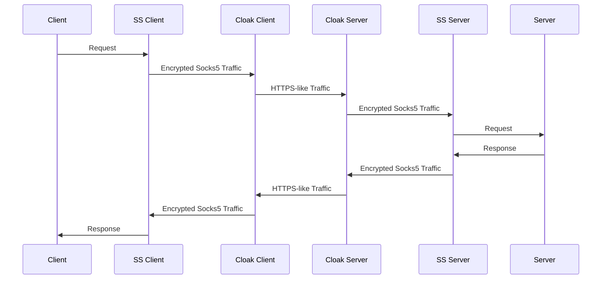
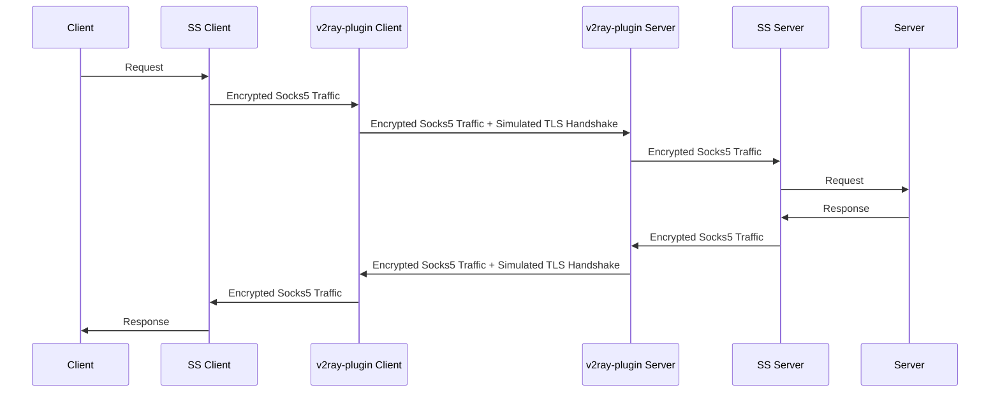
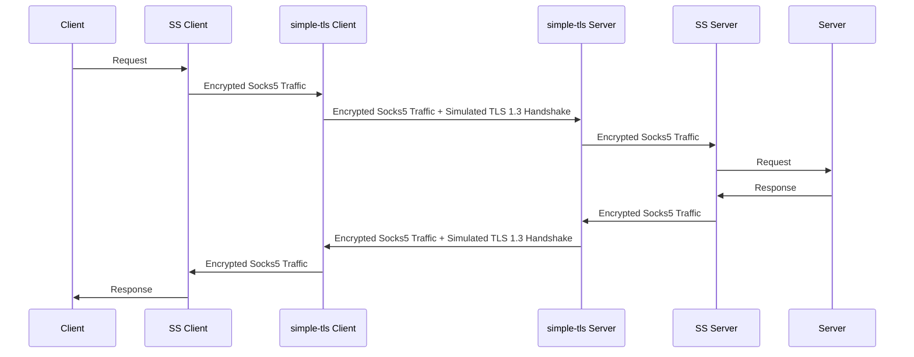
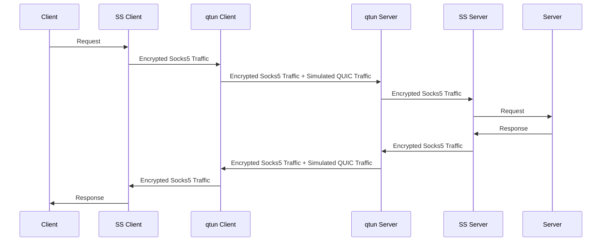
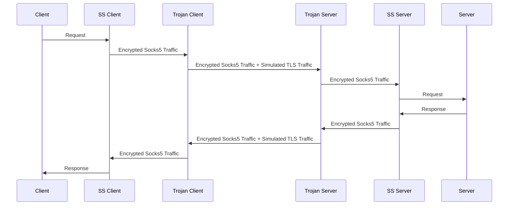
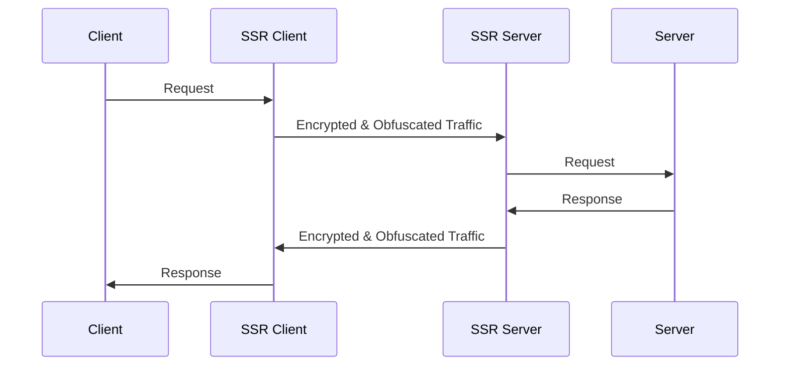
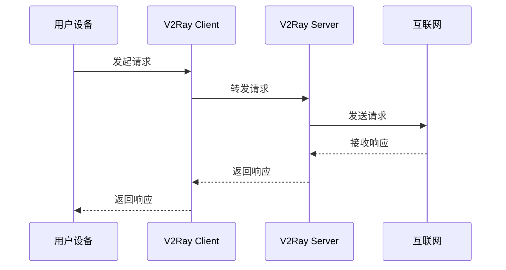

<!-- omit from toc --> 
# GFW Tool 简介

**作者对翻墙的定义：未必要用proxy,vpn，只要能够耍手段达到自己要的目的都是翻墙。如抵抗DNS污染的[hosts项目](https://github.com/googlehosts/hosts)（虽然已失能）**

<!-- omit from toc --> 
## Table of contents
- [Shadowsocks](#shadowsocks)
  - [simple-obfs](#simple-obfs)
  - [kcptun](#kcptun)
  - [Cloak](#cloak)
  - [v2ray-plugin](#v2ray-plugin)
  - [simple-tls](#simple-tls)
  - [qtun](#qtun)
  - [trojan](#trojan)
- [ShadowsocksR \& ShadowsocksRR](#shadowsocksr--shadowsocksrr)
- [V2Ray](#v2ray)

---

Shadowsocks、ShadowsocksR 与 ShadowsocksRR 可视为同一家族的成员。它们都为用户提供加密的 SOCKS5 代理服务，但各自也有其独特的特性与优劣势。

## [Shadowsocks](https://chat.openai.com/c/shadowsocks-libev-%E6%90%AD%E5%BB%BA.md) 

Shadowsocks 是该家族中的先行者，首次提出了 SOCKS5 的加密代理概念。它的代码质量一直以来都是公认的优秀，而且其架构也为高效率与高可扩展性提供了坚实的基础。然而，尽管其优势明显，但 Shadowsocks 的插件设置也相对复杂，这也成为了其主要的缺点之一。目前，Shadowsocks 已被中国防火长城完全识别。想要了解更多相关信息，您可以参阅[相关论文清单](https://github.com/shadowsocks/papers/blob/master/README.md)。

Shadowsocks 的基本架构如下：

* 优点：代码质量优良、高效率、高扩展性，适合扩展使用。
* 缺点：扩展插件的设置相对复杂。
* 现况：已被中国防火长城完全识别。

### [simple-obfs](https://chat.openai.com/c/shadowsocks-libev+simple-obfs-%E6%90%AD%E5%BB%BA.md) 

simple-obfs 是一款能够将网络封包伪装成 HTTP 或 TLS 数据流的插件。尽管其在提供匿名网络服务上发挥了一定的作用，但由于维护工作已被放弃，其现在已经不再被推荐使用。

simple-obfs 的基本架构如下：

* 优点：部署快速、设置简单、支持多客户端、执行效率高。
* 缺点：已被停止维护。
* 现况：尽管 simple-obfs 已被停止维护，且由于其仅提供封包伪装而未进行 TLS 握手操作（会被中国防火长城识别为无握手行为），但它仍可以在一定程度上提供服务。

### [kcptun](shadowsocks-libev+kcptun.md)   

kcptun 是一款基于 KCP 协议的 UDP 隧道工具。它的主要功能是将 TCP 流转换为 KCP+UDP 流。KCP 是一种快速可靠的协议，能以消耗 TCP 流量的 10%-20% 的带宽换取平均延迟降低 30%-40%，且最大延迟降低三倍的传输效果。

kcptun 的基本架构如下：

* 优点：传输速度极快。
* 缺点：需要配置两个服务器端和两个客户端，配置过程较为复杂。
* 现况：由于许多云服务供应商可能对 UDP 流量持负面态度，使用 kcptun 的主机有可能面临被 VPS 封锁的风险。

### [Cloak](shadowsocks-libev+Cloak.md)   

Cloak 是一款为 Shadowsocks 服务设计的插件，它通过模拟 HTTPS 流量来混淆你的网络流量，使得防火墙无法有效识别。

Cloak 的基本架构如下：

Cloak 的功能与 Shadowsocks 完美配合，提供了更好的隐蔽性，对抗网络审查和干扰。

### [v2ray-plugin](SS+v2ray-plugin-搭建.md) 

v2ray-plugin 是一个改进版的 Shadowsocks 插件，它不仅实现了 TLS 握手过程，而且能够模拟 TLS 封包流量，这使得它在绕过防火墙方面表现得相当出色。然而，v2ray-plugin 的设定过程相对复杂，需要证书和 Cloudflare 的配合。

v2ray-plugin 的基本架构如下：

虽然 v2ray-plugin 的速度可能不是最快的，但其稳定性却是一大亮点，能有效提高在网络审查环境中的稳定连接性。

### [simple-tls](shadowsocks-libev+simple-tls.md) 

simple-tls 是 Shadowsocks 的一个改进版插件，继承并改良了 simple-obfs 的 TLS 伪装功能，实现了对 TLS 1.3 握手的模拟。此插件特点在于强制使用 TLS 1.3，提供高级的安全性。同时，其还支持 Shadowsocks 的 SIP003 插件模式，并且具有对 Android 客户端的支持。

此外，simple-tls 的体积小于 2M，却具有高性能，因此非常适合在路由器上使用。

simple-tls 的基本架构如下：

### [qtun](shadowsocks-libev+qtun.md) 

qtun 是 Shadowsocks 的一个插件，其主要功能是模拟 HTTP3 QUIC 流量。这种模拟 QUIC 流量的方式，可以在网络传输中实现更好的性能和安全性。

qtun 架构如下图所示：

### [trojan](shadowsocks-libev+trojan.md)

trojan 是一个处于实验阶段的项目，其主要目的是模拟TLS握手行为并伪装成TLS封包流量。此项目可以有效地骗过中国防火墙。

相关讨论包括：
* [关于shadowsocks 希望可以纳入trojan作为SIP003的邀请](https://github.com/trojan-gfw/trojan/issues/8)
* [trojan 官方对SIP003的说明](https://github.com/trojan-gfw/trojan/wiki/Shadowsocks-SIP003-Integration)

trojan的架构如下图所示：

尽管该项目具有诸多优点，如模拟TLS握手行为、能够骗过防火墙等，但其缺点也不可忽视，包括搭建过程繁琐、需要凭证、客户端支持较少等。当前，trojan在速度上相比v2ray更快一些，因为其少了一层加密。

## [ShadowsocksR](shadowsocksR.md) & [ShadowsocksRR](shadowsocksRR.md)

ShadowsocksR 和 ShadowsocksRR 是 Shadowsocks 的一种变种，在 Shadowsocks 还没有插件系统时，它们的作者就已经尝试了各种类型的流量伪装技术，包括 HTTP 伪装和随机头部伪装。其中，TLS 的伪装方法与 Tor Project 中的 [meek 插件](https://trac.torproject.org/projects/tor/wiki/doc/meek) 很相似。

ShadowsocksR 和 ShadowsocksRR 的优点包括设定方便以及插件选项多样化。然而，它们也有明显的缺点，比如效率较低、CPU 负荷大、错误多，并且已经停止开发。

以上是 ShadowsocksR 和 ShadowsocksRR 的基本工作原理。当客户端发出请求时，ShadowsocksR/RR 客户端会将其进行加密和伪装，然后传输给 ShadowsocksR/RR 服务器。服务器接收到伪装后的流量，解密并恢复为原始请求，然后向目标服务器发送。在收到目标服务器的响应后，同样地，ShadowsocksR/RR 服务器会对响应进行加密和伪装，然后传回给客户端。

## V2Ray

V2Ray 是一个功能强大且灵活的代理工具，它提供了多种方法和技术来实现网络代理和翻墙。V2Ray 是目前最新的项目，具有许多优点和一些缺点。

**优点**：
- 方法多样：V2Ray 提供了多种代理方式和协议，包括 Shadowsocks、VMess、VLESS、Trojan 等，使用户可以根据需求选择最适合的方式。
- 效果好：V2Ray 的协议和技术设计经过精心优化，能够在网络环境不稳定的情况下保持较好的连接稳定性和传输速度。

**缺点**：
- 设定复杂：相比其他代理工具，V2Ray 的配置和设定相对复杂，需要一定的技术水平和时间来理解和完成配置。
- 客户端不完整：虽然 V2Ray 有多个官方和第三方的客户端供选择，但并非所有平台和操作系统都有完整的官方支持，可能需要依赖第三方开发的客户端。

以上是 V2Ray 的基本架构示意图。V2Ray 由 V2Ray Server 和 V2Ray Client 组成。V2Ray Client 与 V2Ray Server 之间建立连接，并通过 V2Ray 协议进行数据传输，以实现代理和翻墙的功能。V2Ray Client 接收来自用户设备的请求并将其转发给 V2Ray Server，然后 V2Ray Server 对请求进行处理并将响应返回给 V2Ray Client，最后将响应传递给用户设备。

**拥塞控制优化**
穿墙是负责欺骗，但是欺骗不够，可以是因为海底线缆物理现象太糟糕，导致极度不稳定。所以需要委托kernel的封包控制管理。

**通信软体Proxy**
目前只见过telegram
> MTProxy 这是telegram 自己专属设计的代理协议，设计架构感觉很复杂应该很安全。